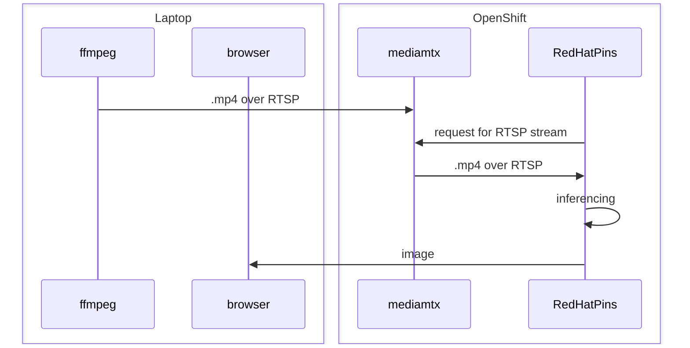

# Red Hat Pins Demo

This repo is forked from [here](https://github.com/redhat-ai-edge-pins-demo/redhat-pins-ai-demo.git).

The original repo only built images for ARM64 - this repo uses a different base image in order to also build for x86_64.

This repo contains a git submodule (`container/yolov5`) so don't forget to clone with the `--recurse-submodules` option.

## Demo

To run the demo, execute the following

	docker compose up

This will start 3 containers:

01. `mediamtx` - this will serve as the RTSP server

01. `ffmpeg` - this streams the sample video (`container/video.mp4`) to `mediamtx`

01. `pins` - this is the Red Hat Pins web application; it is configured to use `mediamtx` as a video source via the `VIDEO` environment variable

Once all 3 containers are up, access the pins with a web browser at <http://localhost:8080>

## Running on OpenShift

A sample manifest is located in [`yaml/red-hat-pins.yaml`](yaml/red-hat-pins.yaml). This deploys the Red Hat Pins web application with the image-embedded `video.mp4` as a video source.

### Deploying Red Hat Pins and mediamtx on OpenShift

To deploy the Red Hat Pins web application with mediamtx on OpenShift,

01. Create a new project

		export PROJ=demo

		oc new-project $PROJ

01. Deploy the manifests

		oc apply \
		  -n $PROJ \
		  -f ./yaml/red-hat-pins-mediamtx.yaml

01. Wait for the `mediamtx` service's external load-balancer to be provisioned

		echo -n 'waiting for load-balancer...' \
		&& \
		while true; do
		  export MEDIAMTX="$(oc get -n $PROJ svc/mediamtx -o jsonpath='{.status.loadBalancer.ingress[0].hostname}' 2>/dev/null)"
		  if [ -z "$MEDIAMTX" ]; then
		    echo -n '.'
		    sleep 5
		  else
		    echo $MEDIAMTX
		    break
		  fi
		done

01. Wait for the Red Hat Pins web application to start - it will take a while for the image to be pulled since it is fairly large (16GB)

		oc wait deploy/rh-pins \
		  -n $PROJ \
		  --for=condition=Available \
		  --timeout=600s

01. Stream the video from your local machine

		docker run \
		  --name ffmpeg \
		  --rm \
		  -it \
		  -v ./container/video.mp4:/host/video.mp4 \
		  --entrypoint "/bin/sh" \
		  bluenviron/mediamtx:latest-ffmpeg \
		  -c \
		  "ffmpeg \
		    -re \
		    -stream_loop \
		    -1 \
		    -i /host/video.mp4 \
		    -c copy \
		    -f rtsp \
		    rtsp://$MEDIAMTX:8554/mystream"

01. Retrieve the Red Hat Pins route URL

		PINS="http://$(oc get route/rh-pins -n $PROJ -o jsonpath='{.spec.host}')" \
		&& \
		echo "URL = $PINS"

01. Access the Red Hat Pins web application with a web browser at the URL from the step above

#### Troubleshooting

*   Logs for the Red Hat Pins pod

		oc logs -n $PROJ -f deploy/rh-pins

*   Logs for the mediamtx

		oc logs -n $PROJ -f deploy/mediamtx

*   Retrieve Red Hat Pins route

		oc get -n $PROJ route/rh-pins

*   Retrieve mediamtx service

		oc get -n $PROJ svc/mediamtx
